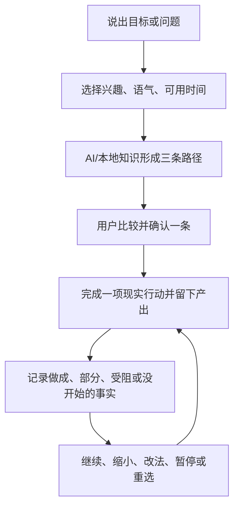

# 向己·智能目标导师 V2.2 产品方案（KB V2.1 不变）

## 1. 产品承诺

用户不需要先懂思想家、选对导师或完成人生问卷。只需说出一个真实目标、问题或想要的改变，系统就必须把既有知识库转成：

1. 三条可比较的现实路径；
2. 一项今天能开始、能停止的行动；
3. 一个可见产出和完成信号；
4. 一条可回定位的“思想 → 判断 → 行动”推导；
5. 一轮“行动 → 事实 → 校准 → 下一步”闭环。

成功不以阅读多少理论、连续打卡多少天衡量，而以用户是否留下现实产出、获得新事实并据此做出下一轮决定衡量。

## 2. 冻结知识基线

- 知识版本仍为 V2.1.0，默认层 `mentor_goal_core_v21`。
- 10 位导师、40 个主要主题、30 个次级主题、160 个深层模块、350 条目标核心依据维持不变。
- 每位导师的 6 阶段旅程、8 步目标设定、6 个生活实践、6 条诊断路由和 4 个案例维持不变。
- 所有生成内容只能使用本轮候选路径给定的导师、概念、证据和边界；知识不足时停止确定性归因，不以模型记忆补写。

V2.2 改变的是“如何把知识变成用户结果”，不是替换知识库。

## 3. 根本问题与设计纠正

| 旧实现问题 | 根本原因 | V2.2 纠正 |
|---|---|---|
| 先选导师才能开始 | 把知识分类当成用户任务 | 先输入需要；导师可选，系统先给三条路径供比较 |
| 只有一张抽象火种卡 | 把文案生成当成方案 | 每条路径必须有行动、分钟数、产出、完成信号和七天验证范围 |
| 核心目标链没有 AI | AI 只接入私人书籍问答 | AI 接入“需要 → 情境理解 → 三条知识路径”，失败时明确本地接管 |
| 看不出 AI 做了什么 | 生成过程无可见凭证且不持久 | 显示并保存模型、模式、情境理解、盲点、依据数量和降级原因 |
| 思想家只是说明卡 | 概念未参与行动推导 | 每条方案显示思想家、概念、来源、本案例应用、推导理由和边界 |
| 功能多但不知道怎么用 | 缺少模块级帮助和案例 | 常驻目标导师助手；三个完整七天案例可一键填入 |
| 行动依赖自律和压力 | 把坚持当成产品机制 | 用户选择 2/5/10/20 分钟；未行动先检查步骤、条件、方法或目标变化 |

## 4. 核心闭环



闭环中的每个状态必须保存。没有事实回填，系统不得把“已打勾”当作完成学习；没有知识依据，系统不得把一般建议包装成思想家的方法。

## 5. 第一次使用：三步完成

### 5.1 写真实需要

- 必填：目标、问题、困难或想要的改变，一句话即可。
- 可选：期望结果、当前阻碍。
- 原因：用户拥有问题定义权；系统不得宣称发现了“唯一真实目标”。

### 5.2 选择低负担偏好

- 兴趣：创作、学习、事业、关系、身心、探索。
- 支持方式：轻一点、直接行动、先看盲点。
- 可用时间：2、5、10、15、20 分钟。
- 性质：本轮交互偏好，不是人格诊断或永久标签。

### 5.3 比较三条知识路径

固定提供“先做出一个成果”“先看清再行动”“用七天让现实回答”。三条路径使用不同知识角度，但都必须回答“做什么、为什么、做到哪里算完成、留下什么、依据是什么”。用户选择后才创建主目标。

## 6. AI 的职责与可见证据

AI 只承担需要推理和情境转换的工作：

- 把模糊输入改写为可验证情境，而不替用户定义本质；
- 比较知识候选路径，指出可能改变行动的盲点；
- 在已有知识边界内生成情境化行动、产出和完成信号；
- 回答模块操作、当前行动和思想依据问题。

每次规划必须显示并持久化“智能凭证”：是否请求 AI、是否实际使用、提供商/模型、情境理解、盲点问题、使用的依据 ID、失败或降级原因。未配置模型、请求失败或结构不合格时，本地知识规则接管，且不得伪称 AI 已参与。

外发前递归隐藏邮箱、手机号和证件号。用户可在每次规划或提问前关闭 AI。

## 7. 知识到行动的强制契约

| 字段 | 必须回答的问题 |
|---|---|
| 思想家与概念 | 这一步基于谁、哪个概念？ |
| 可回定位来源 | 在哪本资产、哪个位置可以核对？ |
| 本案例应用 | 这个概念怎样改变对当前情况的理解？ |
| 推导理由 | 为什么由这个判断推出这项行动？ |
| 理论边界 | 哪些情况不能据此推断？ |
| 现实产出 | 用户行动后会留下什么看得见的东西？ |
| 完成信号 | 做到哪里即可停止，不受外部结果控制？ |

理论没有改变本案例判断或行为时，不进入前台方案。AI 不得发明导师、概念、引文或来源。

## 8. 模块级智能助手

助手常驻页面右上角，能回答“我现在该做什么”“字段填什么、为什么”“三条路径有什么差别”“这一步基于哪个思想和来源”“没做、受阻或目标变了怎么办”。纯操作问题本地即可回答；允许 AI 时，可基于当前目标、行动、功能目录和本轮知识来源补充。回答不得发明产品功能。

## 9. 动力、个性化与心理边界

产品通过自主选择、兴趣匹配、可见进展、低门槛行动、可恢复失败和现实产出来增强动力。允许提醒，但默认关闭、每日最多一次、支持安静时段和暂停。

禁止羞耻、威胁、敌人刺激、创伤利用、损失恐惧、断签惩罚、宣称比用户更了解其本质，以及以“离不开产品”为目标制造依赖。产品可以提供一般性情绪支持和高风险转介，但不是心理治疗、诊断或危机服务。

## 10. 默认案例与用户痕迹

内置三个可一键填入的完整案例：恢复晨间写作、验证职业转型、提出有边界的关系请求。每个案例包含输入、偏好、选择路径、现实产出、七天记录、至少一次受阻和最终校准。案例保存在 `xiangji_goal_examples.dart`，同时作为测试数据和用户参照。

## 11. 发布验收（只测目标导师范围）

```bash
flutter analyze lib/xiangji_goal_mentor lib/services/task_runner.dart
flutter analyze test/xiangji_goal_mentor
flutter test test/xiangji_goal_mentor
flutter build apk --release
```

必须通过：三条方案的具体性与差异、知识来源约束、AI 参与凭证、递归脱敏、无 AI 降级、助手操作问答、三个七天案例、单主目标、行动反馈与校准、安全边界和 APK 构建。不得为本次改造重复运行未来军师、意志之镜、火种等无关模块专项测试。
