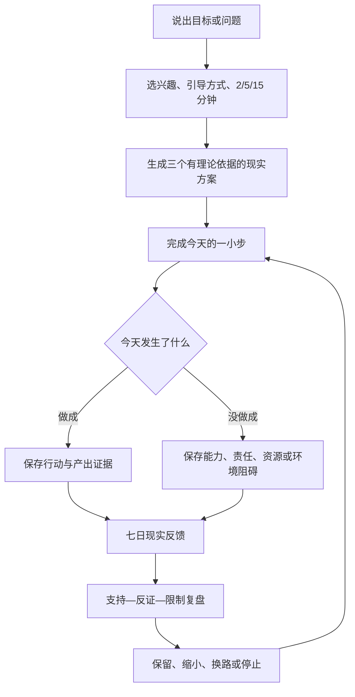

# 《意志之镜》V5.0 产品方案：从思想到现实成果

## 1. 本次重构结论

V4 的证据边界、反证门、离线知识库和加密 Vault 保留不变；用户主流程全部重做。

旧结构要求用户先理解“表象、Why Tree、Real-Me、行动镜、获得性格”等概念，再自行猜测怎样组合。V5 改为一个连续业务闭环：用户只需说出一个目标或问题，产品负责把相关思想转换成今天能做的行动，并用现实反馈决定下一步。

产品的第一价值不再是“展示思想是什么”，而是：

> 帮助用户在低压力条件下完成一个现实动作，留下可检查的产出，再用产出和反例逐渐形成更可靠的自我认识。

## 2. 产品边界

- 不改变 V4 的 22 条理论证据、证据等级、原始定位和误用边界。
- 不宣称测量物自身、本质、唯一真实需要、童年根因或固定人格。
- 不诊断、不治疗，也不把“心理疗愈”作为产品功效承诺。
- 不把一次回答、一次高能量体验、一次失败或问卷结果升级为性格结论。
- 不把“真实欲望”直接等同于“应该行动”；安全、伦理、同意、责任和现实条件仍是硬边界。
- 不采用羞耻、威胁、社会比较、损失恐惧、连续打卡惩罚、无限滚动或利用用户创伤的沉迷设计。产品追求用户信任和自主使用，不追求依赖。

## 3. 用户核心任务

### 3.1 目标入口

用户说：“我想完成作品集初稿。”

系统必须帮助用户得到：

1. 七天后可观察的变化；
2. 当前最主要的现实阻碍；
3. 三个不同能量/兴趣路径的方案；
4. 今天的具体动作和完成信号；
5. 行动后的现实证据；
6. 七天后的保留、反证与下一轮修订。

### 3.2 问题入口

用户说：“我总是拖到最后才开始。”

系统不能把它直接解释为懒惰、缺乏意志或创伤。系统先生成一个低风险动作，帮助区分：不想、不会、资源不足、责任冲突、环境限制、比较压力或其他变量。

## 4. 核心业务闭环

闭环没有“失败”状态；只有新证据、需要调整和用户主动停止。

## 5. 三套个性化方案

每次都提供三套方案，用户自由选择，不由系统宣布哪一套“最适合你”。

| 方案 | 适用状态 | 当日动作 | 主要依据 | 产出 |
| --- | --- | --- | --- | --- |
| 现在做出一个痕迹 | 想直接行动、精力有限 | 2/5/15 分钟留下一个可再次打开的痕迹 | `SCH-B4-055-ACTION-CHARACTER`、`TAL-L13-SEVEN-DAY-STRENGTH` | 一个真实产出 + 行动证据 |
| 先看清一个关键阻碍 | 不知道为什么卡住 | 回答一个具体 Why，立刻做由答案产生的最小动作 | `SCH-B2-029-MOTIVE`、`SCH-B2-029-MOTIVE-BOUNDARY`、`TAL-L12-REALLY-WANT` | 一个动机线索 + 现实尝试 |
| 用七天让生活回答 | 脑中争论太久 | 每天小行动，记录能量、持续性和是否愿意继续 | `TAL-L13-SEVEN-DAY-STRENGTH`、`SHELDON-ELLIOT-1999-SELF-CONCORDANCE` | 一组现实反馈 + 下一轮调整 |

个性化只改变动作形式与表达：创造、学习、连接、整理、探索、照顾；引导风格为直接行动、侦探探索、轻松陪伴；时间预算为 2/5/15 分钟。它不是人格量表，也不显示分数。

## 6. 功能—思想—产出追踪矩阵

| 功能 | 解决的问题 | 用户输入 | 固定流程 | 现实产出 | 理论依据 |
| --- | --- | --- | --- | --- | --- |
| 今日实践闭环 | 不知道怎么开始、学了不行动 | 目标/问题、七天变化、障碍、精力 | 输入 → 选方案 → 行动 → 记录 → 修订 | 当日痕迹、七日记录 | 叔本华 §55；Tal L13；Sheldon & Elliot 1999 |
| 兴趣与低压力偏好 | 统一任务形式造成压力 | 兴趣、引导风格、2/5/15 分钟 | 三次选择，可随时改 | 个性化动作措辞与预算 | Tal L13/L22；VIA 边界 |
| Deep Why | 把手段当目的、无限追问 | 具体目标与变化 | 产生新结构时继续；循环即转 Where Else | 动机树与候选 | 叔本华 §29；Tal L12 |
| 变量探针 | 把社会影响或反抗当全部解释 | 条件前后变化与解释 | 每次只改一个变量；反对/反对消失成对 | 变量候选 | Tal L12/L22 |
| Real-Me | 靠抽象标签判断兴趣优势 | 具体时刻、主动性、观众、能量 | 记录事实 → 跨情境比较 → 找反例 | 兴趣/优势候选证据 | Tal L13/L22 |
| 行动镜 | 口头叙述没有现实检验 | 行动、持续、代价、限制 | 记录可观察动作和外部条件 | 行动证据 | 叔本华 §53/§55 |
| 证据矩阵 | 确认偏误和固定标签 | 支持、反例、限制 | 三栏分开；无反证不发布性格结论 | 可修订候选与置信带 | 叔本华 §54/§55；V4 反证门 |
| 七日现实实验 | 在脑中争论目标真假 | 候选、小动作、完成信号 | 低风险实践 → 每次反馈 → 七日修订 | 现实反馈与下一轮 | Tal L13；Sheldon & Elliot 1999 |
| 随身助手 | 不知道用什么、怎么填、为什么 | 自然语言问题 | 本地目录回答 → 可选逐次 AI 授权 → 引导下一步 | 通俗解释和操作步骤 | 全部能力目录与 KB，受 §22/反证门约束 |
| 数据与隐私 | 私密反思泄露或不知情上传 | 用户主动内容 | 字段加密、本地默认、逐次授权、可导出/删除 | 可控的私密记录 | V4 数据边界 |

应用内 `WillMirrorCapabilityCatalog` 是此表的可执行版本；指南页和助手都从它读取，避免说明与功能分叉。

## 7. 信息架构

### 首页首屏

1. 目标/问题二选一；
2. 一句话输入框；
3. 唯一主按钮“带我做到今天第一步”；
4. 悬浮“问助手”。

### 有进行中实践时

首屏只显示：

- 现在只做这一件事；
- 预计 2/5/15 分钟；
- 做到哪里算完成；
- 思想依据；
- 开始计时；
- “做了”和“没做成”两个平等记录入口。

Deep Why、Real-Me、行动镜、证据矩阵、实验明细和 KB 全部移到“进阶工具”，保留能力但不增加新用户认知负担。

## 8. 智能助手

助手必须掌握：

- 所有功能的“是什么、解决什么、填什么、怎么填、为什么、产出什么”；
- 当前用户处于流程哪一步；
- 三个默认完整案例；
- 22 条 KB 的摘要、产品规则和误用边界；
- 数据发送与隐私范围。

默认使用本地能力目录回答。用户勾选“仅本条允许发送给已配置 AI”后，才发送：本条问题、当前步骤摘要、匹配的功能目录和 KB 摘要；不会发送整个 Vault，发送后授权自动关闭。

AI 输出必须：

- 最多四步；
- 引用输入中存在的 KB ID；
- 不发明功能、思想家或引文；
- 不诊断、不治疗、不宣布本质；
- 没行动时保留能力、责任、资源和环境限制；
- 危机词触发安全转介，不继续目标激励。

## 9. 动机与参与设计

产品通过以下方式提高行动意愿：

- 让用户选择感兴趣的行动形式；
- 把动作缩小到真实可用精力；
- 提前写清“做到哪里就算完成”；
- 立即产生可见痕迹；
- 把没做成转为有价值的阻碍信息；
- 用现实反馈显示成长，而不是用口号、羞耻或连续天数制造压力；
- 允许用户换路、缩小、暂停和删除。

这是一种自主支持型参与机制，不以抓住用户弱点、制造依赖或“失去产品就失去意义”为目标。

## 10. 默认案例与操作说明

`assets/will_mirror/example_cases_v5.json` 保存三个完整案例：

1. 拖延作品集；
2. 辞职与自主需要；
3. 关系中的低风险表达。

每个案例包含输入、个性化选择、生成行动、完成信号、理论 ID、七天做成/没做成记录、结果和下一轮修订。CI 必须校验：至少三个案例、每例七天、每例至少一次没做成、所有理论 ID 存在。

## 11. 数据与隐私

- V4 独立 Vault 与 Android Keystore AES-256-GCM 保持不变。
- V5 偏好、行动方案和助手历史使用 `wm_setting.value_enc` 加密保存。
- 目标、Why、证据、候选、实验和观察继续使用原有加密字段表。
- 导出包含 V5 偏好、行动方案和助手历史，并继续执行明文副本警告。
- 删除继续使用 SQLite `secure_delete`、删除 Vault 文件并销毁 Keystore 密钥。

## 12. 验收标准

### 首次价值

- 新用户无需理解任何术语即可从首页开始。
- 三步内生成三个具体方案。
- 每个方案包含动作、时长、完成信号、产出、为什么和理论依据。
- 用户能在应用内开始计时并记录现实结果。

### 可理解性

- 每个功能都有“是什么、解决什么、填什么、怎么做、产出、为什么、理论依据”。
- 助手能回答开始、字段、卡点、功能、依据、案例和隐私问题。
- 指南包含完整流程图。

### 闭环

- 做成保存行动证据和实验观察。
- 没做成保存阻碍观察，不生成“没有欲望”结论，并把下一步缩为 2 分钟准备动作。
- 同一自然日只能形成一次七日实验进度，防止反复点击伪造“七天”。
- 七次反馈后结束本轮并允许开始下一轮。

### 知识约束

- 所有能力与方案引用的理论 ID 必须存在于 22 条 KB。
- 未完成反证检索时不得发布经验性格结论。
- 不显示人格百分比和未经用户填写的欲望分数。

### 安全与伦理

- 默认本地；云端 AI 逐条授权。
- 不使用操控性沉迷机制。
- 危机问题停止目标指导并建议立即寻求现实支持。
