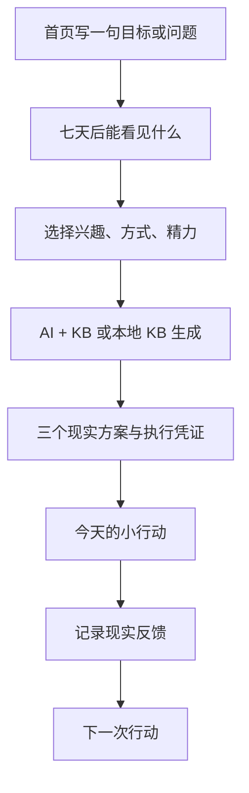

# 《意志之镜》V5.0 用户操作说明书

## 最短用法：三步得到今天的行动

1. 在首页选择“目标”或“问题”，写一句具体的事。
2. “七天后变化”和“当前障碍”不确定可以留空；选择兴趣、引导方式和今天能给的 2/5/15 分钟。
3. 选择本次是否授权 AI + 知识库生成，从三个方案中选一个，按“今天做”和“做到哪算完成”开始。

完成后选择“我已经做了”；没有完成也直接选择“没做成，记录阻碍”。两者都会帮助系统调整下一步。

## 每个字段怎么填

| 字段 | 填什么 | 好例子 | 避免 |
| --- | --- | --- | --- |
| 目标/问题 | 一件具体的事 | “我想完成作品集初稿” | “我要变得更好” |
| 七天后好一点（可空） | 能看到或确认的变化 | “有两页能发给朋友的草稿” | “我会很成功” |
| 当前障碍 | 真实卡点，可不填 | “怕做不好，打开文件就逃开” | “我就是懒” |
| 兴趣 | 最容易吸引你的活动形式 | 创造、学习、连接、整理、探索、照顾 | 选别人觉得最好的 |
| 引导方式 | 今天希望被怎样带着做 | 直接行动、侦探探索、轻松陪伴 | 当作固定人格 |
| 精力 | 今天真实可承受的时间 | 2、5 或 15 分钟 | 按理想状态夸大 |

## 三个方案怎样选

### 现在做出一个痕迹

适合：知道大概要做什么，但迟迟没开始。

示例：围绕“作品集”，用 5 分钟写第一页标题和三行要点，到点就停。

结果：一个能再次打开的真实产出，以及一条行动证据。

依据：叔本华 §55 的行动镜；Tal L13 的七日优势实践。

### 先看清一个关键阻碍

适合：一直卡住，不知道第一步或分不清真正动机。

示例：回答“如果没有害怕做不好，我最先会做什么”，再把答案缩成 5 分钟动作。

结果：一个更具体的阻碍线索和一次现实尝试。

依据：叔本华 §29 的具体动机与认识边界；Tal L12 的逐层认领。

### 用七天让生活回答

适合：在脑中争论很久，仍不知道目标是否适合自己。

示例：每天 5 分钟推进作品集，记录能量、最像自己程度和是否愿意继续。

结果：一组现实反馈和下一轮调整依据。

依据：Tal L13；Sheldon & Elliot 1999；叔本华 §55。

## 做成以后怎样记录

只回答三个三选项，再按需补一句事实：

1. 做完能量更低、差不多还是更高；
2. 如果条件合适，还愿不愿意自然继续；
3. 这一步有没有带来想要的变化；
4. 具体发生了什么（可不填）。

系统保存一条行动证据和一次实验观察。它不会因为一次完成就宣布你具有某种固定性格。
同一自然日只记一次七日进度，不能靠连续点击把一天伪装成七天。

## 没做成怎样记录

选择“没做成，记录阻碍”，只点一个最接近的原因，再按需补一句事实：

- 加班后没有精力；
- 不知道使用哪个工具；
- 照顾家人占用了时间；
- 看到他人结果后开始比较，压力上升；
- 目标本身突然不再重要。

不要写“我就是懒”“我没有毅力”。系统也不会把没行动自动解释为没有欲望。
保存后，下一次不会再统一输出同一句准备动作：时间/责任会生成真实时间窗，步骤不清会生成一个可查询问题，完美压力会生成不公开的第 0 版，资源不足会寻找替代，目标变化则允许换路或停止。

## 怎样确认 AI 真的工作了

在生成方案前保持“本次让 AI 结合知识库生成”，点击“仅本次授权 AI + 知识库生成”。结果顶部会显示：

- “AI 已参与”及实际模型，或“本地知识规则已接管”及原因；
- AI 对当前情况的暂定理解和一个盲点问题；
- 实际使用的知识记录数量；
- 每个方案内“概念怎样应用到当前案例、为什么推出这一步”。

这份凭证随方案加密保存，回到首页仍然可见。若没有看到“AI 已参与”，就代表本次没有用 AI；产品不会把本地模板伪装成 AI。发送前会自动隐藏邮箱、手机号和证件号等直接标识。

## 怎样使用随身助手

可以直接问：

- “我不知道从哪里开始。”
- “七天后好一点怎么填？”
- “Why Tree 是干什么的？”
- “今天没做成说明什么？”
- “这个建议基于哪位思想家？”
- “哪些内容会发送给 AI？”

默认回答完全在本地生成。只有勾选“仅本条允许发送给已配置 AI”，本条问题和当前步骤摘要才会发送；发送后自动关闭。每条回答底部都会明确显示“本地知识库回答”“AI 已参与”或“AI 未完成、本地知识库接管”。

## 进阶工具何时使用

| 工具 | 何时用 | 产出 |
| --- | --- | --- |
| Deep Why | 目标像一个手段，想理解它承担什么功能 | 动机树和边界提示 |
| 变量探针 | 怀疑认可、比较、反抗或工具功能参与 | 变量候选，不是真假判决 |
| Real-Me | 想寻找兴趣和优势的生活事实 | 最像自己时刻证据 |
| 行动镜 | 想检查口头目标与真实行为 | 行动、持续、代价与限制证据 |
| 证据矩阵 | 想形成稳定候选 | 支持、反证、限制三栏与置信带 |
| 七日实验明细 | 想查看或补充每日观察 | 现实反馈和下一轮修订 |
| 理论证据 | 想核对来源和误用边界 | 原始定位、证据等级、产品规则 |

## 完整案例

应用内“看完整案例”保存了三个七日案例。每个案例都包含没做成的日子，因为真实流程必须证明：没做成不会被当作失败，而会帮助发现需要调整的条件。

## 安全说明

《意志之镜》用于结构化自我反思，不诊断、不治疗。涉及伤害自己、他人或即时危机时，不要继续依赖目标流程，请立即联系当地紧急服务、危机支持热线或可信任的人陪伴。
