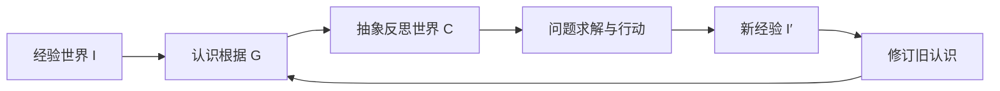
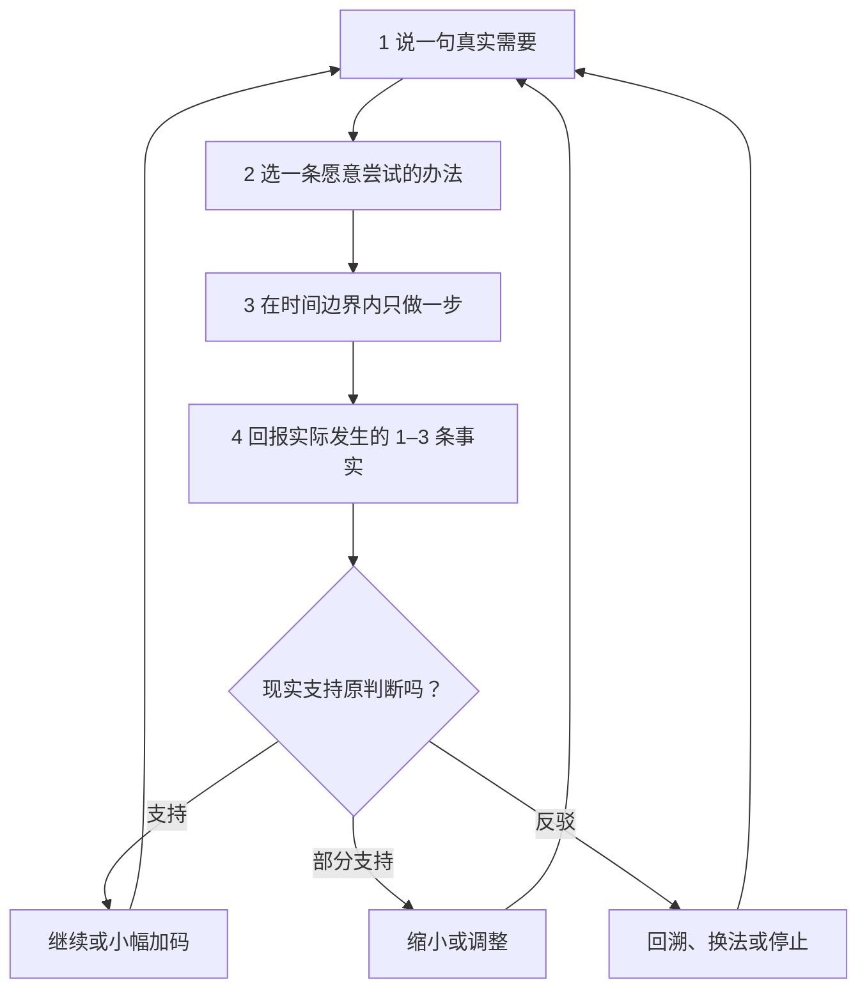
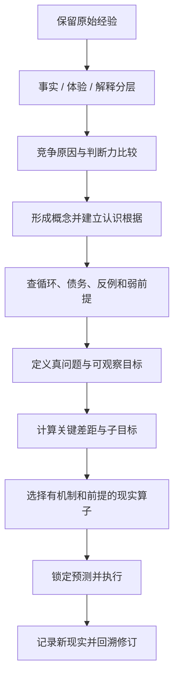
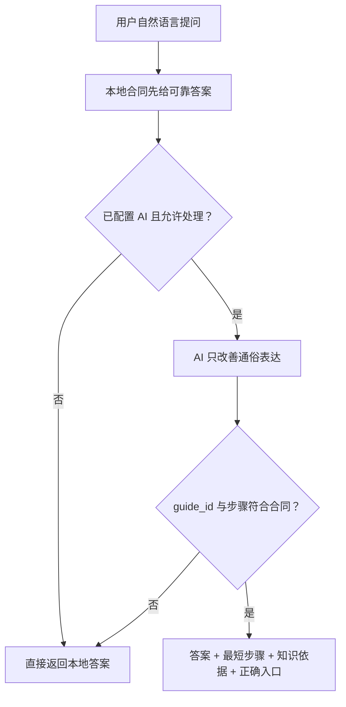

# 向己·未来军师 V6.2 现实产出版

> 状态：历史基线。用户实测证明 V6.2 尚未让个性化、当前状态助手和知识到技能迁移真正生效。当前产品合同已升级为 [`xiangji_future_strategist_v6_3_knowledge_to_outcome.md`](xiangji_future_strategist_v6_3_knowledge_to_outcome.md)。

## 1. 这次为什么必须重做

此前版本的认识模型、知识图、Agent 和状态机已经相当完整，但默认页面把内部结构直接交给了用户：用户先看到工作区、概念、态势、差距、假设和战略术语，仍然不知道今天到底该做什么。它能够解释“系统有什么”，却没有稳定交付“用户在现实中得到什么”。

V6.2 不删除原有知识与求解能力，而是重新划分职责：

- 用户负责说出真实问题、目标、卡点或行动结果；
- 军师负责在后台完成认识分层、因果比较、根据审查、问题求解和路线重算；
- 用户只确认一条自己愿意执行的办法；
- 现实结果拥有最终验算权；
- 阅读概念、打开页面或完成打卡都不能冒充现实产出。

产品唯一使命冻结为：

> 把一个真实问题或目标，转换成今天能做的一步，并用行动后的现实继续修正。

## 2. 不可改动的知识内核

用户提供的《向己·未来导师 V5.0》继续作为叔本华 L0 产品基线。冻结主链保持不变：

产品仍完整保留 24 项 L0 核心概念、14 项 MEC 运行能力、SCK/CEL/PS 规则、三层解题和 17 步认识算法。原典概念与产品操作化必须分标，不能把“认识债务”等产品术语冒充叔本华原话。

### 2.1 前台简单不等于删减知识

《向己·未来导师 V5.0》明确要求行动模式隐藏叔本华、大量分析和多个 AI 建议，只显示当前任务、目的和反馈事实。因此：

- 完整知识在“思想与知识依据”中全部可查；
- 当前问题只展示本轮真正生效的原则；
- 当前行动隐藏非必要分析；
- 每项功能仍能展开“为什么这样做”和对应 L0 概念；
- 新现实必须回写假设、概念、差距、办法或路线。

## 3. 用户永远只需循环四步

| 步骤 | 用户只需做什么 | 系统在后台做什么 | 必须产出 |
|---|---|---|---|
| 说出需要 | 用一句话说目标、问题、卡点或结果 | 保留原话，分开事实、体验、解释、目标和未知 | 可修改的真问题 |
| 选择办法 | 在轻松起步、稳步推进、现实挑战中选一条 | 比较根据、原因、差距、成本、兴趣、能量和可逆性 | 用户确认的办法 |
| 只做一步 | 达到时间或停止条件就回来 | 锁定目的、机制和事前预测，隐藏非必要分析 | 现实行为或外部结果 |
| 回报现实 | 报告做了什么、发生了什么、哪里意外 | 对照预测，继续、缩小、换法、回溯或停止 | 改判、经验和下一步 |

## 4. 后台仍执行完整认识与求解算法

用户无需操作下列步骤，但系统不能跳过：

三层解题顺序保持：认识题 → 概念题 → 行动题。系统不得从用户一句话直接跳成模板建议。

## 5. 默认界面重新设计

### 5.1 首页

首页只突出三件事：

1. “你现在想解决什么？”的一句话入口；
2. 当前唯一行动，或行动结束后的现实回填；
3. 四步闭环、使用助手、完整案例和可选个性化。

问题记录、长期决定、认识变化、行动列表、复盘、知识和设置保留在“更多工具”，默认收起。

### 5.2 对话结果

默认结果不再先显示完整驾驶舱，而是：

- 我理解你要解决的真问题；
- 希望现实变成什么；
- 军师一句可修订判断；
- 同一方向下的三种行动负担；
- 被选行动的时间、停止边界、机制和现实预测；
- “选择这条并开始”。

完整态势、假设、差距、战略与方法事件只在用户主动点击“展开完整推演”后出现。

### 5.3 三种负担，不是三套真相

| 方案 | 适用情况 | 设计原则 | 示例 |
|---|---|---|---|
| 轻松起步 | 能量低、卡在开始 | 3 分钟启动，允许停止 | 只准备材料并开始第一小段 |
| 稳步推进 | 能量一般、方向明确 | 完成一个可停止周期 | 发出一份定向申请 |
| 现实挑战 | 能量较高、喜欢探索 | 获得一条外部结果，不靠硬撑 | 联系真实招聘方并记录回应 |

兴趣与偏好只调整负担、语言和呈现，不得改变事实、因果判断、安全边界或目标所有权。

## 6. 每个功能都必须回答七个问题

所有可见功能的内置说明必须同时具备：

1. 这是什么；
2. 什么时候用；
3. 用户需要填写什么；
4. 怎样操作；
5. 最终产出什么；
6. 解决什么现实问题；
7. 基于哪个思想、知识节点或产品规则。

当前功能组与知识落地如下：

| 功能组 | 现实产出 | 主要知识依据 |
|---|---|---|
| 说出问题或目标 | 真问题、关键差距、现实动作 | 经验世界 I、抽象世界 C、目标判据 |
| 选择现实办法 | 用户确认的行动 | 判断力、目标操作化、行动/反思边界 |
| 选择使用方式 | 合适的负担、语气与时间 | 认识根据、决定性差异、系统性/确定性 |
| 当前唯一行动 | 现实行为或外部结果 | 直观/概念之别、熟练行动、新现实修订 |
| 行动后反馈 | 预测—现实、改判、下一步 | 感觉阶梯、可证伪规则、新现实修订 |
| 完整解题台 | 可审计问题模型 | 认识根据、泉水—水渠、弱前提 |
| 根据与认识债务 | 补证任务或降低承诺 | 概念循环、认识债务、根据率 |
| 直觉与因果区分 | 候选原因和安全观察 | 未概念化直觉、知性因果、竞争原因 |
| 重大长期决定 | 主路线、后手、退出条件 | 根据强度、系统性/确定性、弱前提 |
| 完整案例 | 可模仿的完整闭环 | 镶嵌画、判断力、反例边界 |
| 我的认识变化 | 经验/解释/改判版本 | 表象的表象、新现实修订 |
| 个人经验科学 | 条件、样本、反例和规则版本 | 归纳边界、Wissenschaft、现实修订 |
| 思想与知识依据 | 思想→功能→案例的追踪 | 24 项 L0、14 项 MEC、运行规则 |
| AI、提醒与数据 | 服务、授权、导出和删除状态 | 系统性/确定性、弱前提、用户主权 |
| 使用助手 | 回答、步骤和正确入口 | 语言/概念关系、目标操作化、产品合同 |

硬门禁：24 项叔本华 L0 核心概念必须至少约束一个可操作功能；任何功能不得以“AI 认为”作为唯一依据。

## 7. 使用助手

使用助手不是泛聊机器人。它只使用同一份版本化产品合同回答：功能是什么、何时用、填什么、怎么做、会得到什么、依据什么，并跳到正确入口。

它不能发明按钮、功能、来源、完成状态或心理诊断。敏感问题未经授权时保持本地回答。

## 8. 默认完整案例

案例作为受保护的产品说明保存在 `xf_guided_case`，不会污染用户自己的问题、行动和统计。每个案例都保留原话、事实、解释、竞争原因、目标、差距、三种路线、选择、预测、现实、改判和下一步。

| 案例 | 真问题 | 示例现实产出 | 关键学习 |
|---|---|---|---|
| 答应试岗却在出门前放弃 | 工作不合适，还是启动阻力在主导 | 真正站到门外并获得到场后的样本 | 紧张不等于无法行动；到场不等于必须长期留下 |
| 想找工作却只浏览 | 方向、材料还是渠道在主导 | 发出定向申请并取得回复/差异 | 一次无回复不能推出“所有方向都不适合” |
| 想散步却完全不想动 | 身体能量低，还是任务过大 | 到门外 1 分钟并记录身体变化 | 小步有效也不能由一次结果变成永久规律 |

用户可以一键把示例原话带入输入框，再改成自己的处境。

## 9. 动机、兴趣与心理障碍的产品边界

产品可以并且应当：

- 从用户主动选择的兴趣、价值、优势、能量和时间调整行动负担；
- 用更低启动成本、清晰进展、友好挑战、选择权和真实结果提高持续使用；
- 把“没做”当作新的现实信息，定位动作、环境、前提或目标问题；
- 允许暂停、退出、换法和关闭提醒；
- 让用户逐渐内化判断方法，降低对 AI 的依赖。

产品不得：

- 以羞耻、威胁、敌人刺激、比较贬损或恐惧维持行为；
- 抓住弱点、创伤或孤独制造依赖；
- 设计断签惩罚、无限连胜、不可关闭提醒或“失去产品就失去意义”的关系；
- 把低能量、拖延或一次失败诊断成人格缺陷或心理疾病；
- 冒充心理治疗、医学诊断或危机服务。

衡量成功的指标不是“停留多久”或“是否沉迷”，而是现实行动轮数、关键差距是否缩小、用户能否说出所用原则、错误认识是否更快被现实修订，以及长期是否减少无效依赖。

## 10. 对补充要求的逐条落实

| 要求 | V6.2 落实方式 |
|---|---|
| 1 全功能说明、流程、案例、痕迹 | 内置逐功能说明、四步流程、3 个完整持久案例、模块专项测试 |
| 2 智能助手 | 离线可靠、AI 可选增强、合同校验、可直达入口 |
| 3 真实产出 | 每轮必须形成行动或现实改判；阅读不计完成 |
| 4 从问题/目标入手 | 首页与对话只有一句自然语言默认入口；L0 贯穿后台 |
| 5 固定业务流程 | 四步用户循环、三层解题、预测—现实闭环 |
| 6 不脱离知识库 | 功能—L0 边、案例—L0 边、24 项覆盖门禁 |
| 7 每项说明来源与意义 | 七问说明合同和可展开知识依据 |
| 8 实践与提醒 | 当前唯一行动、Todo 绑定、现实回填、主动监督可关闭 |
| 9 复杂到简单再到实践 | 默认一句判断/一步行动，完整推演按需展开 |
| 10 思想成为技能 | 本轮原则、现实检验、迁移问题、个人经验科学 |
| 11A 强化学习并形成习惯 | 反复真实闭环、反例和概念版本；不用阅读量冒充成长 |
| 11B 简单、有趣、低压力 | 3/10/20 分钟、三种负担、允许停止、无惩罚 |
| 12 个性化量表 | 60 秒可选兴趣/价值/优势/能量/语气/时间，不做人格诊断 |
| 13 接受、喜欢、信任 | 用价值、透明、可控和真实结果建立信任；明确拒绝成瘾/依赖设计 |
| 14 破除障碍与心理支持 | 小步、保守假设、失败可恢复；不冒充治疗，必要时指向专业支持 |
| 15 调动积极性与潜能 | 价值一致行动、优势借力、友好挑战和可见进展；禁止操纵弱点或不择手段 |

## 11. 专项测试和发布边界

本轮只允许执行与未来军师直接相关的验证：

1. `dart analyze lib/xiangji_future_strategist`
2. `dart analyze test/xiangji_future_strategist`
3. `flutter test test/xiangji_future_strategist`
4. Android Release APK 编译与上传

不运行目标导师、知行树或其他模块专项测试。目标导师工作流也不再把 `lib/xiangji_future_strategist/**` 作为触发路径。

专项验收必须覆盖：

- 24 项 L0 核心全部约束可操作功能；
- 每项功能有七问说明和来源；
- 三个案例完整、可读取且重置个人数据后仍保留；
- 低能量与挑战偏好产生不同负担，但不改变真实问题；
- 离线使用助手可正确路由；
- 默认结果隐藏内部对象和完整驾驶舱；
- 200% 字号下自然语言入口和现实行动卡无异常；
- Action → Reality → Revision 保持既有数据库和状态机闭环。

## 12. 完成定义

只有同时满足以下条件，才能称为“对用户有作用”：

- 用户无需培训就能从一句话开始；
- 军师给出的不是抽象理念，而是一条说明机制、时间、停止条件和预测的行动；
- 用户可以按能量和兴趣选择负担，同时保留最终决定权；
- 行动后无论成功、部分完成、受阻或没做，系统都能形成有依据的下一步；
- 用户能按需知道这一步基于哪个概念、为什么适用、什么现实会推翻它；
- 多轮以后形成可证伪、带反例和版本的个人经验，而不是聊天记录堆积；
- 产品帮助用户增强判断和行动能力，而不是增加界面负担或制造依赖。
