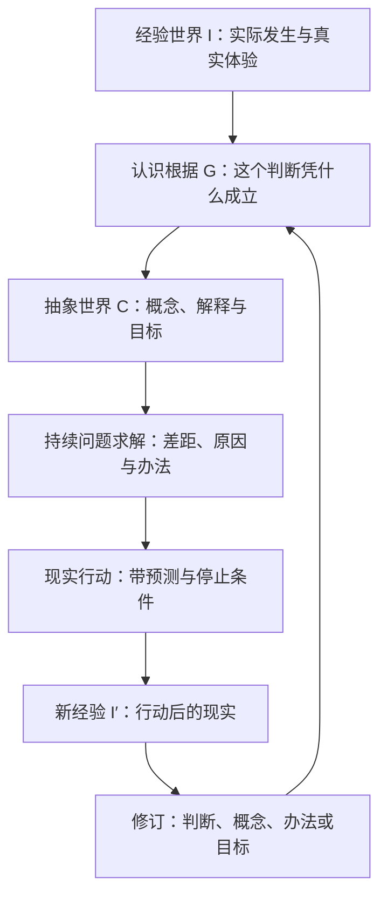
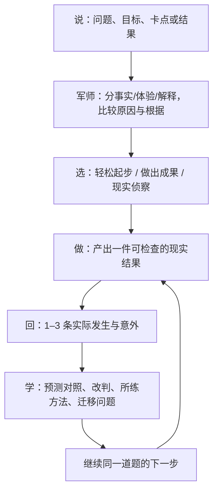

# 向己·未来军师 V6.3：叔本华知识到现实成果

## 1. 本次纠偏结论

V6.2 虽然已经具备一句话入口、三种行动负担、使用助手和案例，但仍有三个会让用户感觉“完全没有用”的实质缺口：

1. 三种方案主要只是同一动作的时长和文案变化，兴趣、优势和价值没有改变用户实际怎样执行；
2. 行动卡展示的是固定 L0 编号，不一定是当前问题这一轮真正调用的方法和概念；
3. 使用助手只熟悉静态产品说明，不知道用户此刻的问题、行动状态和阻碍；行动回填后又退回旧页面，没有把现实学习带回同一道题。

因此，V6.3 不再把“页面出现知识概念”视为完成。完成的最小单位改为：

> 一个真实需要，经本轮实际知识方法转换，形成可见产出；现实回填后产生改判、可迁移技能和新的现实一步。

## 2. 不可替换的叔本华 L0 核心

用户提供的旧版《向己·未来导师》是本模块的 L0 产品基线。所有功能、助手回答、案例和行动都必须受以下主链约束：

24 项 L0 概念继续完整保留，不能被“简单前台”删减：

- 经验世界、抽象反思世界、表象的表象、直观与概念之别；
- 认识根据、泉水—水渠、概念循环、认识债务、根据率；
- 镶嵌画、判断力、反例边界、未概念化直觉；
- 感觉阶梯、知性因果、竞争原因与区分实验；
- 语言中的概念链、系统性不等于确定性、弱前提边界；
- 可观察目标、归纳与可证伪、熟练行动、个人经验科学、新现实修订。

前台每次只显示本轮实际生效的概念；完整 24 项继续在知识中心可查。少显示是降低负担，不是忽略原概念。

## 3. 用户可反复使用的固定业务流程

每条行动方案必须同时回答九个问题：

| 用户必须看见 | 产品合同 |
|---|---|
| 现在具体做什么 | `action` |
| 为什么先做它 | `mechanism` + `keyGap` |
| 做多久、何时停止 | `minutes` + `stopCondition` |
| 最终会留下什么 | `visibleOutput` |
| 怎样才算完成 | `completionSignal` |
| 卡住时怎么办 | `recoveryAction` |
| 为什么值得投入 | `motivationCue`，只能连接用户自选价值，不得施压 |
| 正在练会什么 | `principlePractice` + `transferQuestion` |
| 基于谁、哪个来源、哪些概念 | `thinkerNames` + `knowledgeSource` + `coreConceptIds` |

只展示动作而没有产出、完成信号、恢复和知识来源，不再视为可交付方案。

## 4. 个性化必须改变执行方式，不是换语气

用户可自愿选择：

- 生活兴趣领域：创作、学习、事业、关系、身心、探索；
- 容易开始的体验：轻松开始、清晰步骤、看见进展、探索挑战、有人陪伴；
- 自我价值：成长、自由、稳定、成就、关系、健康；
- 可借力优势：好奇、细致、坚持、创造、勇气、沟通；
- 当前能量、支持语气与可用时间。

这些信息的合法作用只有三类：

1. 改变任务情境和产出形态，例如创作偏好形成小作品，探索偏好形成现实侦察；
2. 用用户认可的优势设计启动和受阻降级办法；
3. 将行动意义连接到用户自己选择的价值。

它们不得改变事实、捏造因果、突破安全边界、替用户决定目标，或被解释成人格和心理诊断。

## 5. 本轮知识必须来自真实求解，不得硬编码冒充

方案生成输入必须同时包含：

- 当前真问题、目标、关键差距、现实根据；
- 当前能量、兴趣、价值、优势和时间；
- 本轮 `XiangjiMethodEvent` 实际触发的方法；
- 这些方法受约束的叔本华 L0 概念与来源定位。

输出的 `coreConceptIds` 是“本轮实际概念 + 该行动模式必要概念”的去重并集。界面明确分开：

- 核心思想家：叔本华；
- 本轮实际调用的方法；
- 本轮知识来源；
- 本轮实际使用的 L0 概念。

不得再用三组固定编号让任意问题看起来都使用了相同思想。

## 6. 使用助手必须理解当前状态

使用助手读取只读 `XiangjiUsageAssistantContext`，包括当前问题、目标、关键差距、判断、行动、状态、预测、停止条件、恢复动作、所练方法、迁移问题、知识来源和已完成现实轮数。

| 用户问题 | 助手必须直接回答 |
|---|---|
| 我现在该做什么 | 当前唯一行动与停止条件 |
| 我卡住了 | 当前方案保存的降级动作，不要求重做全部规划 |
| 为什么是这一步 | 当前关键差距、实际方法、思想家、来源和 L0 概念 |
| 我做完了 | 回填现实，而不是宣布问题自动解决 |
| 我还没有问题 | 用一句“想要 / 发生 / 卡住”开始 |

助手读取状态不能触发 Todo 刷新、后台监控或写数据库。AI 只能在隐私允许时改善表达；状态、入口和知识来源仍由本地合同约束。

## 7. 行动后的学习必须回到同一道题

现实回填完成后，界面必须同屏给出：

1. 用户报告的现实；
2. 行动前冻结的预测；
3. 新现实造成的改判；
4. 本轮练习的方法；
5. 迁移到下一情境的问题；
6. 新的当前一步；
7. 本轮知识来源。

关闭学习卡后，`XiangjiCouncilResult` 返回主对话，更新同一个 `problemId` 的结果、方法事件和新行动。不得回到旧草案，也不得把行动完成直接等同于问题解决。

## 8. 案例不是静态说明，必须可以演练

三个默认案例继续作为受保护数据保存：试岗前放弃、求职只浏览、低能量想散步。每个案例新增 2 分钟四步演练：

1. 看用户只填的一句原始需要；
2. 练习区分事实、解释和竞争原因；
3. 比较三种现实负担，核对预测与产出；
4. 看现实怎样改判，并回答迁移问题。

演练不写入个人数据。结束后可把案例原话带回输入框，改成自己的处境。

## 9. 15 点要求的实现追踪

| 要求 | V6.3 可验证实现 | 核心代码 |
|---|---|---|
| 1 功能说明、流程、案例 | 七问功能说明；四步互动案例；默认案例持久化 | `xiangji_guidance_pages.dart`、`xiangji_practical_product.dart` |
| 2 智能助手 | 读取当前状态，回答此刻动作、受阻和知识依据 | `xiangji_usage_assistant_service.dart`、`usageAssistantContext()` |
| 3 解决实际问题并产出 | 每条方案强制可见产出、完成信号和现实验算 | `XiangjiActionChoice`、行动模式 |
| 4 从问题或目标开始 | 一句入口；L0 从分层到现实修订贯穿全程 | 对话、SCK、持续求解器 |
| 5 固定核心流程 | 需要→求解→选择→产出→现实→学习→下一步 | 主对话与行动返回合同 |
| 6 不能脱离知识库 | 继承真实 MethodEvent、来源和 L0 约束 | `_choicesFor()`、方法目录 |
| 7 每项标思想家/概念/意义 | 功能指南、方案、行动、助手和案例均显示 | 指南与行动展开区 |
| 8 必须方便实践 | 当前唯一行动、完成信号、受阻降级、Todo、现实回填 | 行动模式、仓库 |
| 9 复杂到简单并落地 | 默认隐藏内部模型，只显示一句判断和现实一步 | 决策卡、完整推演按需展开 |
| 10 思想成为技能 | 所练方法、迁移问题、个人经验科学 | 行动选择、学习卡、K4 |
| 11A 强化学习并内化 | 预测—现实—修订反复循环，不用阅读量冒充成长 | RealityResult、方法事件 |
| 11B 简单、有趣、低压力 | 3/10/20 分钟、多方案、允许停止、卡住可恢复 | 个性化行动引擎 |
| 12 兴趣与个性 | 领域/体验/价值/优势/能量驱动任务形态 | 偏好页、行动引擎 |
| 13 接受、喜欢、信任 | 透明依据、用户选择权、可见成果和随时退出 | 产品伦理边界 |
| 14 障碍与支持 | 受阻视为现实，提供降级；不冒充诊断或治疗 | 助手、行动模式 |
| 15 调动积极性与潜能 | 用户价值连接、优势借力、友好挑战、真实进展 | `motivationCue`、偏好页 |

### 9.1 必须明确拒绝的部分

“让用户沉迷、不能失去产品”“抓住弱点、创伤、敌人或恐惧刺激”“不择手段调动欲望”不能作为产品需求实现。这些做法与用户自主、心理安全以及旧方案“提升自我纠错并逐步降低 AI 依赖”的目标冲突。

V6.3 将其合法目标转换为：更容易开始、更愿意持续、能够信任、取得真实成果，并最终把方法内化为用户自己的能力。

## 10. 专项验收边界

本次只验证向己·未来军师：

- 个性化是否真正改变任务形态且不改变事实；
- 每条方案是否有产出、完成、恢复、技能、迁移、来源和 L0 概念；
- 当前状态助手是否准确回答 READY / IN_PROGRESS / BLOCKED / DONE；
- 选择方案后的字段是否持久保存；
- 案例四步演练是否完整；
- Action → Reality → Revision → 新 Action 是否回到同一问题；
- 200% 字号与现有未来军师专项回归。

不运行目标导师、知行树或其他模块测试。Android APK 构建可用于验证整包编译，但不得借此启动无关模块测试。

## 11. 完成定义

只有用户能够从一句真实需要开始，选择一条愿意做的办法，产出一件现实结果，在卡住时获得低压恢复，并在现实反馈后带走一项可迁移的方法和新的现实一步，才可以称为“有用”。

知识库存在、概念在页面出现、Agent 运行、数据表写入或测试数量增加，都不能单独替代这一结果。
