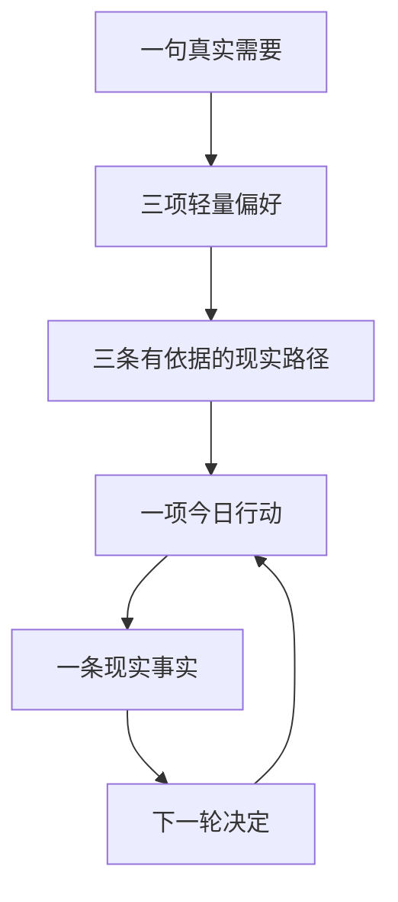

# 向己·智能目标导师 V2.2 使用说明

## 最短用法

1. 在“今天”写一句目标、问题或想改变的现状。
2. 结果和阻碍不知道可以不填。
3. 选择兴趣、希望被怎样带领，以及今天真实可用的时间。
4. 点击“生成三条现实路径”，比较产出、完成信号、思想依据后选一条。
5. 点击“采用这条，开始第一步”。完成后回填发生的事实；系统据此继续、缩小、改法、暂停或重选。

## 每个功能是什么

| 功能 | 填什么/怎么做 | 得到什么 | 为什么存在 | 知识依据 |
|---|---|---|---|---|
| 目标/问题入口 | 写一句当前真实需要；结果、阻碍可选 | 三条候选路径 | 先解决用户问题，不要求先学理论 | 目标核心知识层 + 杜威经验检验 |
| 兴趣选择 | 选择创作、学习、事业、关系、身心或探索 | 更贴近场景的行动和产出 | 兴趣影响例子，不定义人格 | 积极心理学优势/投入边界 |
| 支持方式 | 轻一点、直接行动或先看盲点 | 本轮解释与行动节奏 | 降低压力和无从下手 | 自主选择与可控行动原则 |
| 可用时间 | 2/5/10/15/20 分钟 | 到点可停止的一步 | 不依赖高能量和强自律 | 洛克—莱瑟姆具体目标 + 可控性边界 |
| 三条路径 | 比较产出、成功信号、思想家与理由 | 一条由你确认的方案 | 避免系统替用户宣布唯一答案 | 各路径实际引用的知识证据 |
| AI 智能凭证 | 查看即可 | 模型/本地模式、做了什么、为何降级 | 证明 AI 是否真实参与 | 本轮证据 ID 与严格输出校验 |
| 思想如何推出行动 | 展开方案中的思想卡 | 概念、本案例应用、来源、边界 | 理论必须改变判断和行动 | 对应思想家和可回定位来源 |
| 今天只做一步 | 按触发点执行到最低标准 | 一个可见现实痕迹 | 用证据替代抽象自我评价 | 爱比克泰德可控性 + 行动知识路径 |
| 现实反馈 | 选择做成、部分、受阻或没开始，并写事实 | 继续/缩小/改法/暂停/重选 | 失败先更新假设，不批判人格 | 卡弗—谢尔反馈环 + 杜威经验检验 |
| 目标导师助手 | 问“怎么填/为什么/卡住怎么办” | 当前操作或知识解释 | 随时消除使用障碍 | 功能目录 + 当前方案来源 |

## 怎么判断 AI 是否真的工作

生成方案后先看“智能凭证”：

- “AI 已参与 · 模型名”：模型返回内容通过了结构、知识 ID 和安全校验。
- “AI 未完成 · 本地知识规则已接管”：已请求模型，但未配置、请求失败或结果不合格；下方会显示原因。
- “本地知识规则”：你关闭了本轮 AI，方案由同一知识库离线形成。

无论哪种模式，路径都必须显示知识来源和理论边界。AI 不能绕过知识库自由发挥。

## 完整案例一：恢复晨间写作

- 需要：我想恢复晨间写作，但一想到要写好就不想打开文档。
- 希望结果：七天内留下三次真实写作痕迹，而不是写出完美文章。
- 阻碍：早晨时间不稳定，而且担心写得差。
- 选择：创作与表达、轻一点带我开始、5 分钟。
- 路径：先做出一个成果。
- 第一步：打开文件，5 分钟写一个标题和三条要点；到点就停。
- 现实痕迹：第 2 天没开始，因为先处理工作消息；第 3 天把触发点改到午饭后，写了 82 字。
- 校准：保留写作目标，修改触发条件，不把“晨间”当成目标本身。

应用方法：把完美主义压力转成可修改草稿；用现实反馈校准触发条件。理论不证明用户“本质上拖延”。

## 完整案例二：验证职业转型

- 需要：考虑转向产品经理，但不知道是真喜欢还是只想逃离现在的工作。
- 结果：三个真实岗位样本和一次从业者反馈。
- 阻碍：害怕选错，容易一直比较课程。
- 选择：工作与事业、先帮我看清盲点、15 分钟。
- 路径：先看清再行动。
- 产出：岗位样本表、一个具体询问和一次真实回复。
- 校准：先做小项目验证工作内容，不立刻报课或辞职。

## 完整案例三：提出有边界的请求

- 需要：希望伴侣多分担家务，但每次说到这件事就吵架。
- 结果：一次不指责、可讨论的具体请求和真实回应。
- 阻碍：担心被拒绝，容易一次说完所有旧不满。
- 选择：关系与连接、直接告诉我怎么做、10 分钟。
- 路径：用七天让现实回答。
- 产出：把“你从不帮忙”改成“周三是否愿意洗碗”的可拒绝请求；根据现实协商到周四。
- 边界：产品帮助组织表达，但不承诺控制他人；若存在暴力或控制风险，停止普通目标指导并优先寻求安全支持。

## 卡住时只做这四步

1. 不补打卡，不评价人格。
2. 写一条实际发生的事实。
3. 判断是步骤太大、条件不足、方法无效，还是目标已经变化。
4. 选择缩小、改法、暂停或重选；系统据此生成下一步。

任何页面不明白时，点右上角“目标导师助手”。
