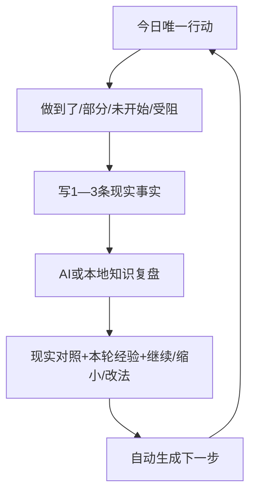

# 向己·智能目标导师 V2.3：15 点要求重设计与验收

## 1. 为什么 V2.2 实际变化不明显

V2.2 把主要改造放在“没有目标时的首次创建页”。一旦用户已有目标，页面立即绕过新流程，继续进入旧的目标卡、行动卡和理论卡。AI 只在首次生成三条路径与助手问答中出现，没有参与用户每天最需要的现实反馈、经验提炼和下一步改写；兴趣、语气、时间也没有按目标保存。因此实现内容虽增加，核心使用体验没有改变。

V2.3 的验收对象改为：一个已有目标的用户，每天能否在首页完成一轮“行动 → 事实 → 复盘 → 下一步”，并留下现实产出与可回定位的方法证据。

## 2. 新的固定业务闭环



每轮保存：原行动、用户事实、事实与预期对照、本轮经验、下一轮决定、下一步、思想家、概念、来源、应用、推导、边界和 AI 执行凭证。没有事实不得完成一轮；没有可回定位知识不得作确定性归因。

## 3. 15 点要求—产品机制—验收痕迹

| 要求 | V2.3 产品机制 | 可验证痕迹 |
|---|---|---|
| 1. 每项说明、流程与案例 | 首页四步流程；字段提示回答填什么/为何；三个七天案例可随时查看 | `今日教练台`、案例底部页、使用说明与专项测试 |
| 2. 智能助手 | 首页和顶栏常驻助手；读取当前目标、行动、功能目录与知识来源 | 回答“现在做什么/卡住/依据/怎么填”，显示 AI 或本地模式 |
| 3. 解决真实问题并有产出 | 每一步必须有最低完成和现实证据；复盘后自动生成下一步 | 已确认成长证据与轮次复盘表 |
| 4. 从问题/目标贯穿始终 | 用户目标、当前行动、现实事实始终绑定同一 `goal_id` | 目标版本、行动、反馈、复盘、下一步完整关联 |
| 5. 固化可循环业务流程 | 首页固定四步闭环，不再把七个按钮和多层对话当作流程 | `goal_round_reviewed` 与连续轮次记录 |
| 6. 不脱离知识库 | 每轮只允许当前导师已核对的 `evidence_id` | AI 严格输出校验；知识不足停止归因 |
| 7. 每功能标注思想依据 | 方法卡显示思想家、概念、来源、本案例应用、推导和边界 | “这套思想正在怎样被你用起来”卡片 |
| 8. 帮助用户实际使用 | 首页先给唯一行动和四种现实结果；高级设置折叠 | 可在同一页完成整轮，不跳知识页面 |
| 9. 复杂概念通俗化并落地 | 复盘只回答事实如何改判断、为什么改下一步 | `case_application` 与 `why_this_action` |
| 10. 思想成为技能 | 只统计已保存的现实复盘次数，不以阅读量或打卡代替 | “已在现实中练习 N 次” |
| 11. 简单、轻松、多方案 | 首次三路径；每天只一项行动；2/5/10/15/20 分钟 | 个性偏好持久化，下一轮按偏好生成 |
| 12. 兴趣与个性适配 | 六类兴趣、三种引导方式、可用时间；非人格诊断 | `xiangji_goal_preferences` |
| 13. 接受、喜欢与信任 | 用户自主选择、AI 透明凭证、失败可恢复、案例可预演 | 不以依赖或沉迷为产品目标 |
| 14. 降低压力与心理障碍 | 未开始/受阻先改条件、大小或方法；安全风险停止普通指导 | 不把未行动解释为意志弱；保留专业转介边界 |
| 15. 调动积极性与潜能 | 使用兴趣、可见产出、现实进展和自主选择增强动力 | 禁止羞耻、威胁、敌人刺激、创伤利用和制造依赖 |

## 4. AI 在哪里实际发挥作用

AI 参与两类高价值转换：

1. 首次把真实需要转换成三条有知识依据的路径；
2. 每轮把“上一步 + 现实结果 + 用户事实”转换成现实对照、可验证经验和下一步。

每次都显示并保存是否请求 AI、是否实际使用、提供商/模型、知识 ID、失败原因和本地接管状态。AI 不能改变用户事实，不能发明思想来源，也不能用通用激励文案替代现实复盘。

## 5. 范围与发布门禁

本次只修改和测试 `lib/xiangji_goal_mentor`、`test/xiangji_goal_mentor` 与目标导师文档。专项门禁：

```bash
flutter analyze lib/xiangji_goal_mentor lib/services/task_runner.dart
flutter analyze test/xiangji_goal_mentor
flutter test test/xiangji_goal_mentor
flutter build apk --release
```

不重复运行未来军师、意志之镜、火种等无关模块专项测试。APK 构建仅作为安装交付门禁，不等同于无关模块功能回归。
