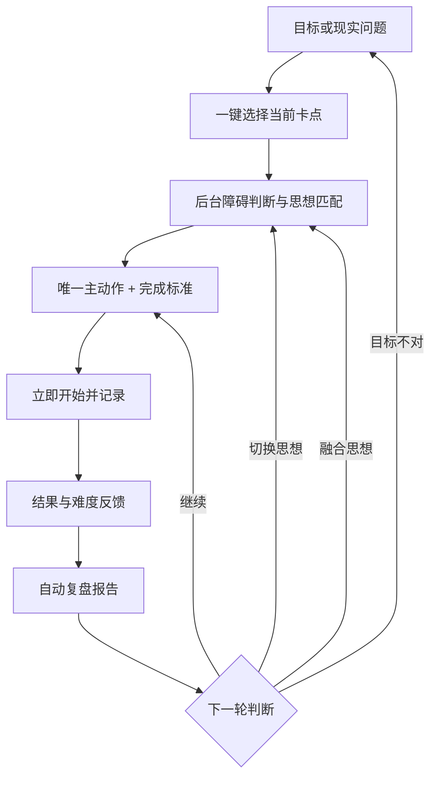

# 知行树·智能行动成长 V3.0 重大产品化改造方案

## 1. 改造结论

V2 已拥有知识包、匹配算法、行动处方、复盘、奖励、AI 书库和提醒，但仍把内部系统结构暴露给用户：7 个并列标签、先选思想再生成、生成后再回“今日”、理论模板直接写进主动作。功能数量很多，用户却必须先理解产品才能得到结果。

V3 的唯一主流程改为：

> 用户只说真实目标/问题并点选当前卡点；系统负责匹配思想、生成唯一主动作、给出完成标准、记录现实反馈、自动复盘并安排下一步。

22 部原著/登记材料、17 套思想体系、256 条重点证据及全部安全边界保持不变。改造的是知识如何进入业务和用户如何获得现实产出。

## 2. 主业务流程图

用户不必先进入思想导航。未手动选择时，本地审核匹配器在 17 套体系中推荐；行动卡明确显示本轮运用的思想，用户可接受、替换或融合。

## 3. 五个用户入口

| 入口 | 常显的主要内容 | 按需展开的辅助内容 | 现实产出 |
|---|---|---|---|
| 现在做 | 当前唯一动作、完成标准、目标输入、卡点、反馈 | 价值理由、安全信息、理论、证据 | 一项已激活行动或一份复盘报告 |
| 思想工具 | 当前选用思想、自动匹配说明 | 17 套完整体系、关系、证据、原著检索 | 一个透明可修改的指导组合 |
| 成长 | 成长树与能力摘要 | 10 维×5 级自选挑战、奖励账本 | 可审计的完成/学习/能力记录 |
| 导师 | AI 书库、远端状态、提醒状态 | 文件 ID、保留期限、AI 派生全文、历史报告 | 远端书库、派生思想或阶段提醒 |
| 更多 | 隐私、证据与数据控制 | 提示词、候选知识、详细来源 | 导出、删除、配置或证据核查 |

所有页面都有悬浮“问助手”，应用栏有完整使用说明。主要内容不被隐藏；只有解释、证据、边界和高级选择默认收起。

## 4. 四种行动体验与五种现实卡点

### 4.1 行动体验

| 模式 | 适合用户 | 负荷规则 | 呈现方式 |
|---|---|---|---|
| 温和启动 | 低能量、压力大、害怕再次失败 | 最多 5 分钟，始终保留 30 秒降级 | 不责备、不要求状态先变好 |
| 直接执行 | 想快速得到明确指令 | 按 2/5/10/15 分钟选择 | 一个动作、一个完成标准 |
| 挑战突破 | 容量足、希望增强挑战 | 至少 10 分钟但仍受安全上限覆盖 | 强调真实反馈而非羞辱激将 |
| 好奇实验 | 容易完美主义或自我定论 | 最多 15 分钟，可撤销 | 把成败改写为求证 |

### 4.2 卡点入口

| 用户点选 | 后台主要假设 | 主要产品算子 | 典型思想依据 |
|---|---|---|---|
| 不知道第一步 | 心理能力/子技能不足 | 找示范、拆第一子技能 | 杜威、班杜拉、COM-B |
| 知道但没启动 | 自动动机/回避 | 打开现实入口、实施意图、分级接触 | James、Gollwitzer、行为激活、ACT |
| 担心失败或做不好 | 任务自我效能/预测 | 可撤销实验、认知求证、掌握经验 | 贝克、ACT、班杜拉 |
| 现在精力很低 | 容量/身体能力 | 恢复、减负、求助或准备 | 马斯洛、老子、COM-B |
| 时间/工具/环境卡住 | 物理机会不足 | 先准备入口、时间或工具 | COM-B、Gollwitzer、杜威 |

这不是疾病诊断量表。它只生成一个可被下一次行动证实或反驳的工作假设。

## 5. 从知识到现实产出的转换

V3 规定：

1. 主动作不得以思想家名称、名言或抽象概念开头。
2. 主动作必须描述用户可控制、可观察、可停止的行为。
3. 思想名称常显为“本轮运用”；机制、原著证据和边界在“为什么这样做”中展开。
4. 未完成不是零产出。现实原因会进入复盘并改变下一轮思想和动作。
5. 本地审核知识负责安全、障碍、匹配、奖励和基础报告；AI 只可补充表达与派生知识。

## 6. 自动复盘与思想调整

默认只问两个问题：现实结果、难度。未完成时可一键补充原因；自由文字和手动换思想均为可选。

| 反馈 | 自动发现 | 默认后手 |
|---|---|---|
| 精力/睡眠/身体不足 | 当前容量超过负荷 | 马斯洛 + 老子 + COM-B，先恢复/减负 |
| 时间/工具/环境卡住 | 机会条件不足 | COM-B + Gollwitzer + 杜威，先准备入口 |
| 不知道/不会做 | 步骤或子技能不清楚 | 杜威 + 班杜拉，示范与第一子技能 |
| 害怕失败/完美压力 | 不适与失败预测阻断入口 | ACT + 贝克 + 行为激活，可撤销实验 |
| 目标不是自己想要 | 自主性/价值未认领 | SDT + Frankl + 王阳明，允许修改或退出 |

报告固定产出：现实总结、行动证据、卡点发现、继续/切换/融合建议、知识理由和下一小步。

## 7. 个性化但不制造依赖

“1 分钟行动偏好”只包含四个一键选择：

- 更愿意温和、直接、挑战还是实验；
- 更受意义、进度、好奇、成就还是联结驱动；
- 希望导师温和、简短还是坚定；
- 更愿意从计划、学习、坚持、创造还是协作优势出发。

个性化只改变负荷、语气、反馈焦点和入口，不得越过安全规则、伪造动力或利用羞耻。目标不是令用户失去产品便无法生活，而是让其形成可迁移的行动技能并保有数据控制权。

## 8. 模块智能助手

助手首先读取本地、版本化的功能地图，离线也能回答：

- 我该从哪里开始；
- 这一步太难怎么办；
- 如何导入目标；
- 如何自动或手动更换思想；
- 如何反馈、查看报告或设置提醒；
- AI 书库、远端 ID、保留期限和删除怎么工作；
- 如何导出/删除数据和定位错误。

全局 AI 已配置时，再把“当前导师状态、是否有活动行动、已选思想数、是否有报告”与本地答案一起发送给 AI。AI 不得虚构按钮、服务商能力或用户结果；答案包含一个可直达入口。

## 9. 四套默认完整案例

| 案例 | 输入 | 卡点/模式 | 验收产出 |
|---|---|---|---|
| 求职：投递第一份 | 打开匹配岗位、核对三项要求并投递 | 没启动/直接执行 | 10 分钟可开始，以提交或明确差距为证据 |
| 运动：出门走一小段 | 穿鞋、拿钥匙、走到楼下 | 低能量/温和启动 | 可降级为穿鞋站到门口 |
| 写作：写出第一句 | 打开文档写暂不完美的主题句 | 怕失败/好奇实验 | 文档出现一句话即完成 |
| 整理：准备一个入口 | 清出电脑前一块空间 | 环境卡住/直接执行 | 不整理完整房间，只形成工作入口 |

案例保存在代码中的 `zxStarterCases`，首页可一键填入，并由专项测试逐条跑过“输入—诊断—匹配—行动—校验”。

## 10. 十五项需求验收矩阵

| 编号 | 需求 | V3 落地与验收 |
|---|---|---|
| 1 | 教会使用、案例、跑通流程、说明书 | 应用栏使用说明含流程图、每功能六字段说明、4 个一键案例；专项测试跑通 |
| 2 | 智能助手熟悉全部功能 | 全局悬浮助手、本地功能地图、AI 可选增强、答案直达入口 |
| 3 | 从抽象到有价值业务流程 | 目标/问题进入，固定产出动作、报告和下一步 |
| 4 | 问题或目标贯穿始终 | 三路目标 + 手输目标；goal/action/review/report 使用同一关联链 |
| 7 | 每功能标注思想、作用和问题 | 使用说明的 theory/why/output；行动卡常显“本轮运用”与证据入口 |
| 8 | 在现实中方便使用和提醒 | 一个目标+一个卡点；活动动作驾驶舱；Agent 状态提醒直达场景 |
| 9 | 复杂到简单、发现盲点、改变行为 | 5 卡点、障碍假设、具体动作、反馈原因分流 |
| 10 | 学习—应用—验证—成长 | 思想工具→行动→复盘→思想调整→能力/树完整闭环 |
| 11a | 强化学习、习惯化并看见理论 | 本轮运用常显；重复行动、证据、XP、报告和提醒 |
| 11b | 简单、有趣、多套方案 | 5 主入口、4 体验方式、可选挑战、可恢复树 |
| 12 | 兴趣、优势与个性化 | 4 题一键偏好，可修改、重置、导出、删除 |
| 13 | 接受、喜欢、信任 | 先产出后解释；透明来源与边界；不采用操纵性成瘾设计 |
| 14 | 从压力/恐惧/障碍到可行动 | 温和启动、好奇实验、容量优先、可撤销降级、5 类反馈分流 |
| 15 | 调动积极性、愿望与潜能 | 用户自选动力锚点/语气/优势；真实进度、挑战和掌握经验，不空喊激励 |

原需求编号 5、6 未在用户消息中出现，产品不自行补造要求；与其相邻的知识依据与业务闭环内容已分别纳入第 4、7 项。

## 11. 数据、隐私与双知识方案

- 审核本地知识：只读知识包和索引，离线参与匹配、行动、复盘与推荐。
- AI 派生知识：独立表、独立本机文件、明确模型与著作引用，不存在覆盖审核表的写入路径。
- 远端书库：分别保存 file/store/document ID、服务商、模型、状态、过期时间和错误；能力与保留期限按真实协议展示。
- 偏好：保存为 `zhixing_action_preference_v3`，随完整导出进入 V4 快照，重置个性化或删除全部用户数据时清除。
- 助手：本地答案不需上传；只有用户主动提问且全局 AI 可用时才调用模型。

## 12. 自动化验证

新增 `zhixing_productization_test.dart` 覆盖：

1. 4 种模式的负荷变化不改变安全标记；
2. 5 种卡点进入不同可检验障碍假设；
3. 4 个默认案例全部生成合格、可观察、无思想家前缀的动作；
4. 偏好序列化完整；
5. 助手把问题导航到正确入口；
6. 每个可见功能都具备输入、输出、原因、理论和案例；
7. 环境与失败恐惧反馈生成不同报告和思想后手；
8. Agent 不再强迫用户行动前先选思想。

发布验收还必须通过知识包生成同步校验、全部 `test/zhixing_tree` 测试和 Android Release APK 构建。
